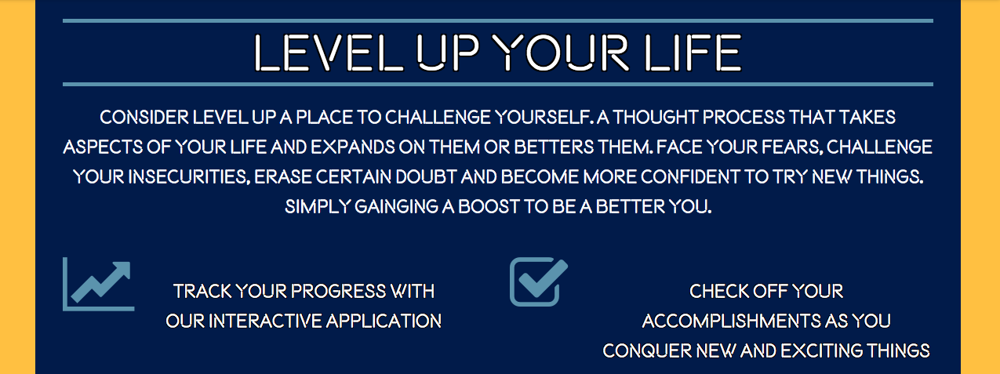

# Level UP

## Description

Our application offer users self-help videos, quotes, and challenges to help them conquer their fears. We focus on gamifying the process, to make self-improvement fun and interactive. 

## Motivation

One of our classmates was interested in self-improvement and had seen application on the app store with a similar concept. However, the apps didn't integrate gamification with self-improvement, so combining the two made sense. 

## Result

Using JavaScript, jQuery, front-end styling, the YouTube and They Said So APIs, and Firebase, we allow users to target specific areas of self-improvement that they want to work on. 

## Team Effort

Tanner and Kyle worked on the user interface - from conception and planning to coding it out. Falon worked on the APIs and corresponding functionality to the topics page design. Jackson worked on Firebase, and the sign-ups through Google and Facebook. 

## Individual Responsibility

### Tanner: 
1. Design a way for users to be able to sign in or sign up
2. Present application overview succinctly 
3. Created a brand surrounding the application
4. Templating the topics page
5. Content to explain the application

### Kyle:
1. Templating the marketing page
2. Content to explain the application
3. Styling and logic for the topics page
4. Match the styling and flow of the original marketing design and duplicate onto the topics page
5. Reactive styling based on functionality requirements

### Jackson:
1. Learn and integrate Google and Facebook log-in functionality
2. Integrate log-ins with the user interface
3. Create persistence through Firebase for the progress users have made
4. Determine which variables to save to Firebase and connect this with user profile
5. Integrate persistence logic into the visual counterpart

### Falon:
1. Learn and integrate the YouTube and They Said So quotes APIs
2. Dynamically populate cards and content onto the topics page
3. Show user progress on page and dynamically demonstrate which tasks have already been completed
4. Determine sequence of logic for completing task and preventing users for readdressing same tasks
5. Integrate content population logic with the user interface

## Challenges

One of the biggest challenges that we encountered was using git merging and branches for the first time. We had to learn to stop being afraid of using git, and make it our friend. 

## Improvements

In the future, we can integrate more categories and more cards. We can also integrate a user page which will have some options for the user to allow push notifications and to see an overview of their progress. 
